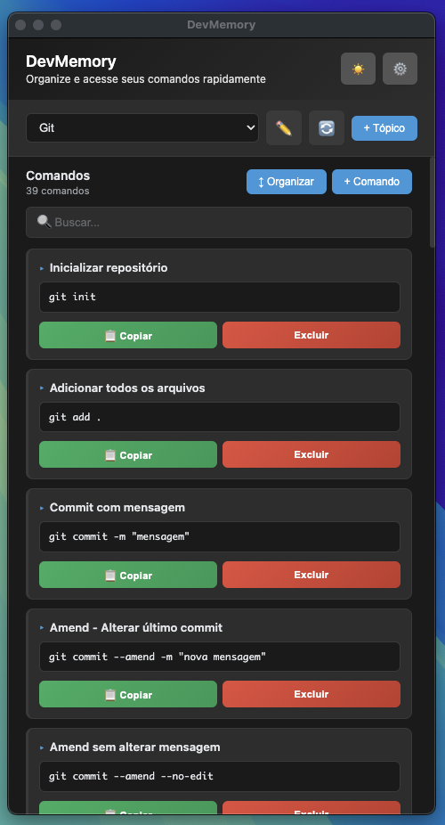
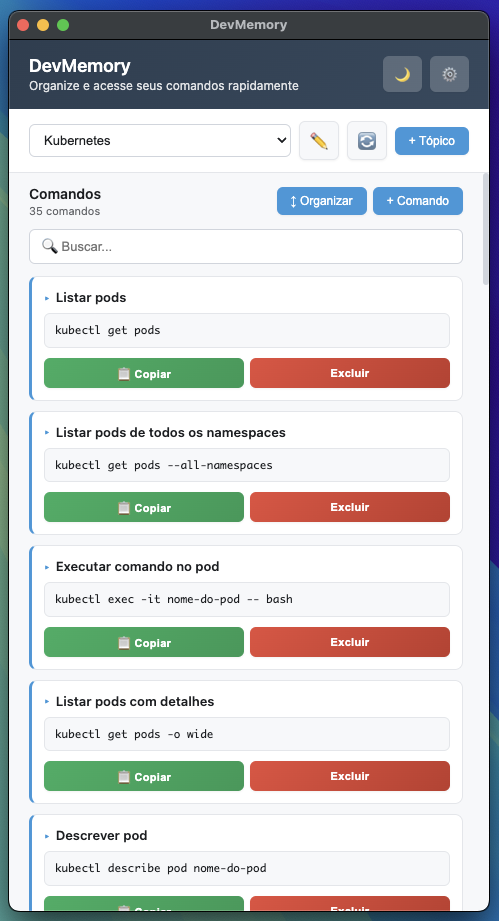

# DevMemory 🧠

**DevMemory** é um gerenciador desktop de comandos, credenciais e snippets desenvolvido com Electron. Mantenha seus comandos mais usados, credenciais e trechos de código sempre à mão, organizados por tópicos.



## ✨ Funcionalidades

- **Comandos**: Salve e organize comandos de terminal com descrição
- **Credenciais**: Armazene logins e senhas de forma organizada
- **Listas**: Crie checklists para tarefas diárias (to-do/done)
- **JSON**: Salve snippets JSON com visualização formatada e busca
- **Texto**: Armazene textos e anotações importantes

### Recursos

- 🎨 **Modo Escuro**: Interface moderna com tema dark
- 🔍 **Busca**: Filtre itens dentro de cada tópico
- 📋 **Copiar**: Copie comandos e credenciais com um clique
- 🔄 **Sincronização**: Dados salvos localmente e na pasta do sistema
- ↕️ **Organização**: Reordene itens por drag-and-drop
- ✏️ **Edição**: Edite nomes de tópicos facilmente



## 🚀 Instalação

### Pré-requisitos

- Node.js (v16 ou superior)
- npm ou yarn

### Clonar o repositório

```bash
git clone git@github.com:MarceloJay/DevMemory.git
cd DevMemory
```

### Instalar dependências

```bash
npm install
```

### Executar em modo desenvolvimento

```bash
npm start
```

## 📦 Build

### Build para macOS

```bash
npm run build:mac
```

### Build para Windows

```bash
npm run build:win
```

Os instaladores serão gerados na pasta `dist/`.

## 💾 Armazenamento de Dados

Os dados são salvos em dois locais:

- **Pasta do projeto**: `commands-data/`
- **Pasta do sistema**: `~/Library/Application Support/devmemory/commands-data/` (macOS)

Toda alteração é sincronizada automaticamente entre as duas pastas.

## 🎯 Tipos de Dados

### Comandos
Salve comandos de terminal com título e descrição. Ideal para Git, Docker, AWS CLI, etc.

### Credenciais
Armazene logins e senhas organizados por serviço.

### Listas
Crie checklists com itens marcáveis (feito/a fazer). Perfeito para dailies e tarefas.

### JSON
Salve snippets JSON com:
- Visualização formatada
- Busca dentro do JSON
- Modal de análise

### Texto
Armazene textos, anotações e snippets de código.

## 🛠️ Tecnologias

- **Electron**: Framework para aplicações desktop
- **JavaScript**: Linguagem principal
- **HTML/CSS**: Interface do usuário
- **Node.js**: Runtime

## 📝 Licença

MIT

## 👤 Autor

Desenvolvido por MarceloJay

---

⭐ Se este projeto foi útil para você, considere dar uma estrela no repositório!
